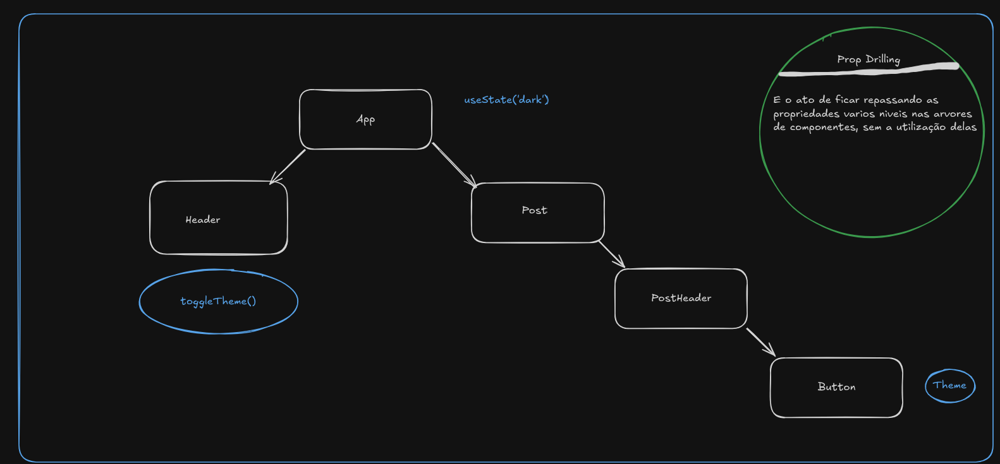
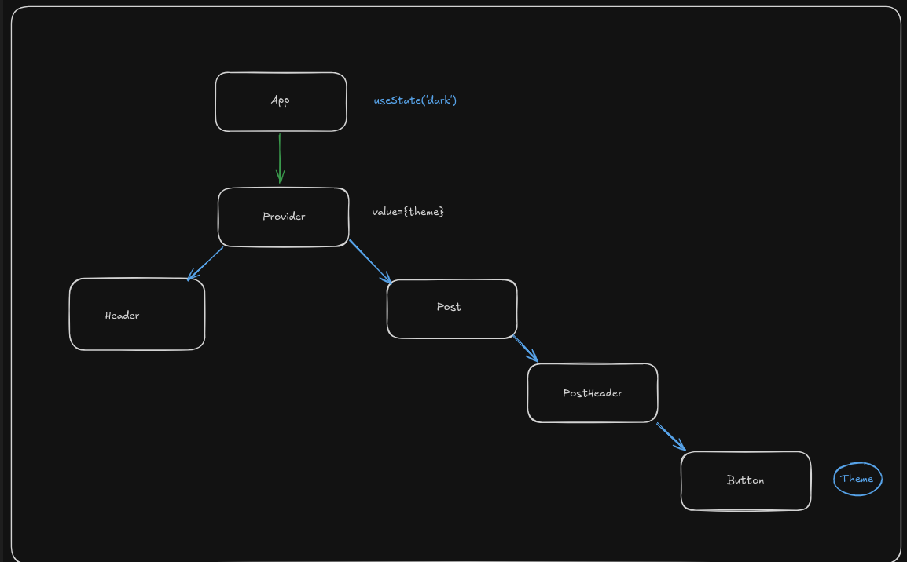

# Context

### Prop Drilling

> [!NOTE] O que é
> **Prop drilling** é um problema que acontece quando precisamos obter dados que estão em várias camadas na **árvore de componente react**. 

> [!NOTE] Contexto geral
> Imagine que você tem uma mensagem importante para entregar a uma pessoa no final da sala. Em vez de passar diretamente para ela, você precisa entregar para cada pessoa no caminho até chegar ao destino. Isso é o Prop Drilling!

*Nesse caso aqui, Passamos a propriedade de Pai para filho `App -> Post({theme}) -> PostHeader({theme}) -> Button`, nesse cenário não e possível enviar do `App -> Button`. Imagine mais um cenário onde temos a função `toggleTheme (Alternar tema)`, onde queremos alterar o estado theme do button mas direto do header? E necessário encontrar um ponto comum dentro dessa arvore de componente, dentro do app armazenamos o tema e passamos de componente em componente ate chegar no button. *

### ContextAPI

> [!NOTE] O que é
> Serve para criar um Contexto de informações da aplicação.

*Ao invés do componente app enviar os dados diretamente para o Header e Post, Continuamos criando as informações direto no componente `App`, porem o filho direto desse `App` é o `Provider` (Que a própria context provê). Para o provider passos a `Prop` chamada value, que nada mais são do que as informações que queremos compartilhar dos nossos componentes, e a partir disso da criação do contexto e do uso do nosso componente, todos os `filhos | children` eles conseguem acessar o `Value`, sem que seja necessário ficar repassando as propriedades de pai para filho explicitamente.*

> [!NOTE] Resumo
> A context nada mais é do que uma forma de passarmos as propriedades vários níveis abaixo sem passar elas explicitamente